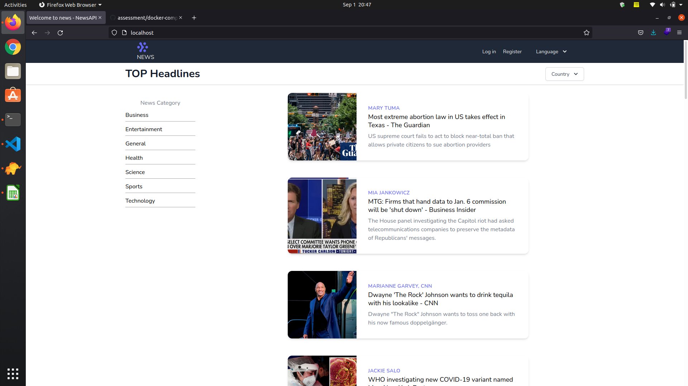

Test Assignment

## About Test

Create a Laravel application to display news. Users must see news from various sources and countries,
and they should be able to filter news by country and source.The frontend shows a list of news headlines, and upon clicking any headline, it shows the complete news article, along with the number of likes and dislikes.

## How to run

- **Clone the project**
- **Rename .env.example to .env**
- **Start docker**
- **Install Node Modules**
- **Migrate the database**
- **Run the watch command**

### Welcome Page
